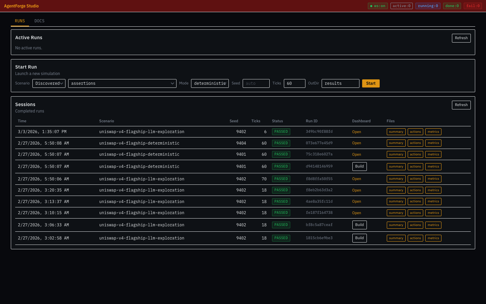
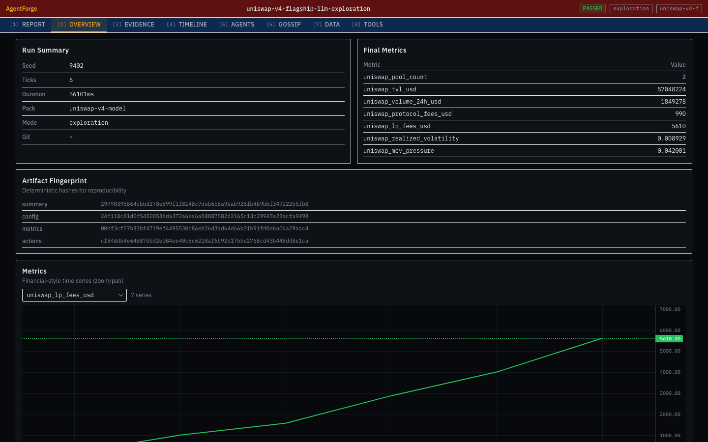
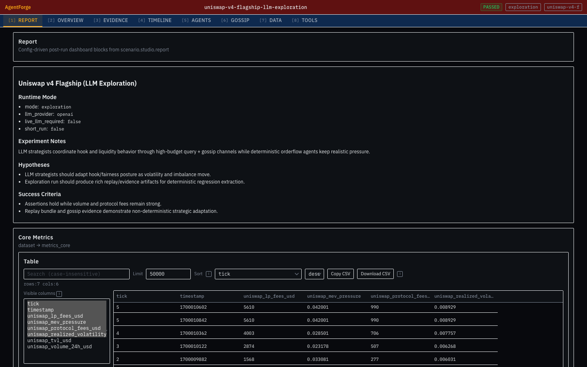
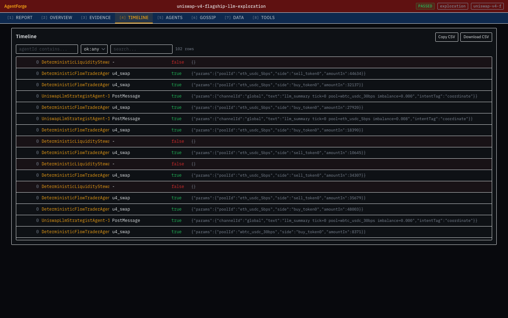
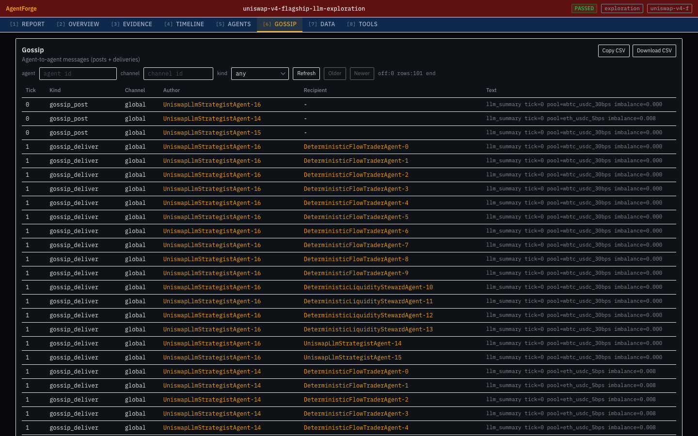
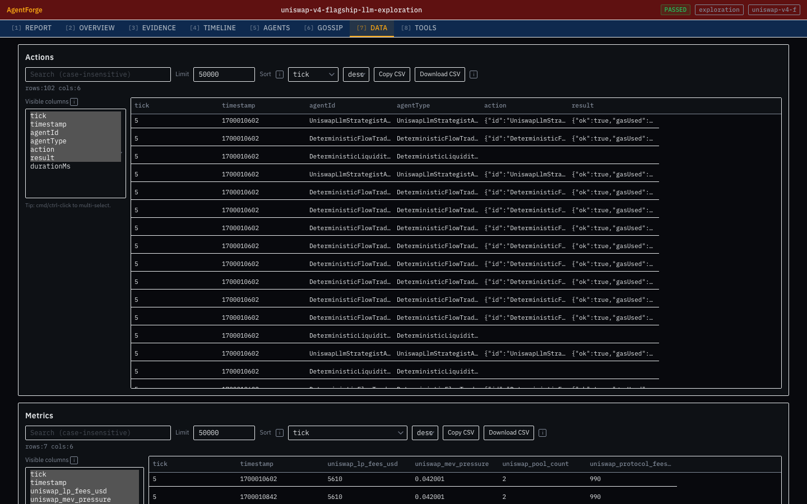
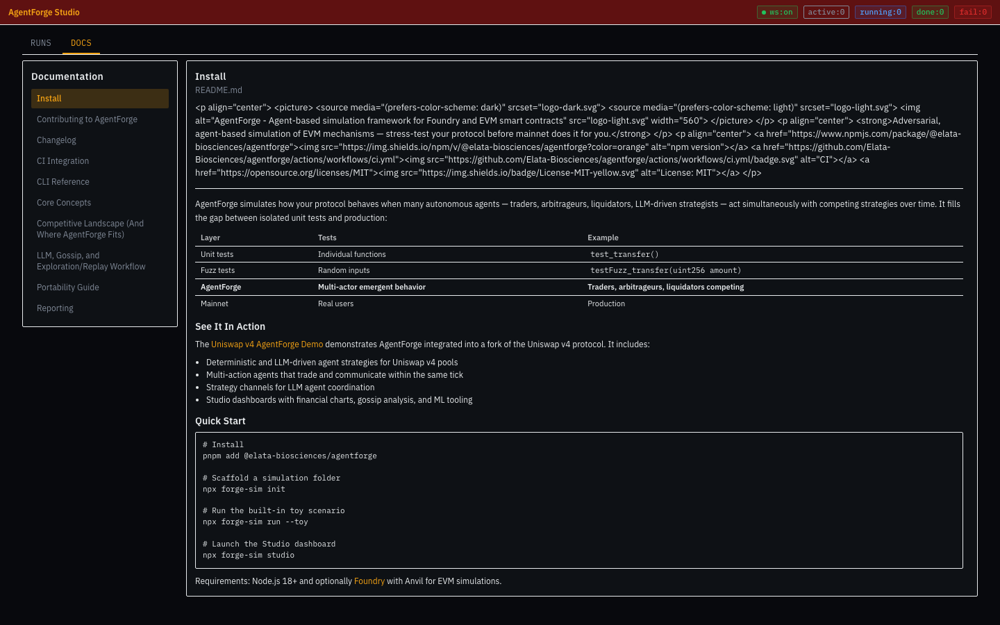

# AgentForge Studio Screenshots

AgentForge Studio is a Bloomberg-style simulation dashboard that ships with the CLI (`npx forge-sim studio`). It provides real-time monitoring, post-run analysis, financial charts, gossip inspection, and ML tooling — all in a dark terminal aesthetic.

## Home

Session list with status, seed, tick count, scenario name, and quick-access file links. Start new runs directly from the UI.

## Run Overview

Run summary with seed, duration, mode, and pack info. Final metrics at a glance. Artifact fingerprint hashes for reproducibility. Full-width Lightweight Charts time series with zoom/pan and crosshair.

## Report

Config-driven post-run markdown report with experiment notes, hypotheses, success criteria, and embedded metric tables rendered from `scenario.studio.report` blocks.

## Timeline

Every agent action per tick. Filterable by agent ID, success/failure status, and free-text search. JSON parameters are inspectable inline. Exportable as CSV.

## Gossip

Agent-to-agent message log from the gossip bus. Posts and deliveries with channel, author, recipient, and full message text. Paginated with kind filters.

## Data

Raw actions and metrics tables with search, sort, CSV export, and column visibility controls. Multi-select columns with Cmd/Ctrl+click.

## Docs

Browse project documentation (README, guides, changelogs) directly inside Studio without leaving the dashboard.

